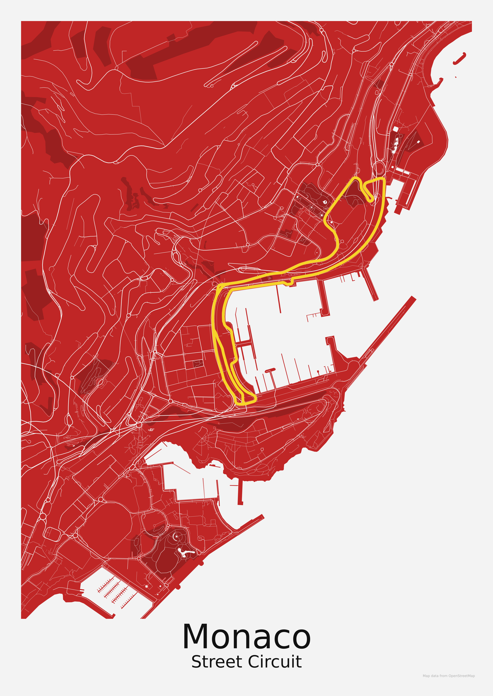
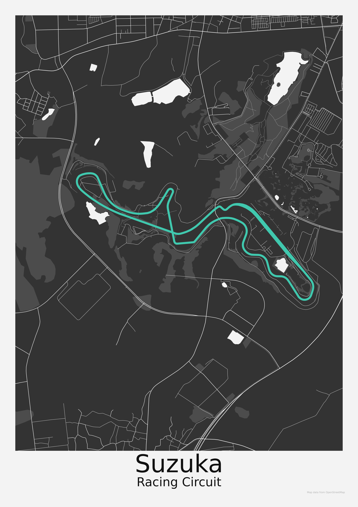

# GOA Bulk Generator

A tool for generating map posters in bulk using OpenStreetMap data. The generator creates SVG and optionally PNG images with customizable templates, map layers, and text areas.

## Gallery

<table>
    <tr>
        <td></td>
        <td></td>
        <td></td>
    </tr>
    <tr>
        <td></td>
        <td></td>
        <td></td>
    </tr>
</table>


## Features

- Fetches and processes OSM data for map layers (land, water, streets, etc.) custom bounding boxes
- Customizable poster templates and text boxes
- Outputs SVG files, with optional PNG export via Inkscape

## Dependencies

- [drawsvg](https://github.com/cduck/drawsvg) (for SVG generation)
- [osmnx](https://osmnx.readthedocs.io/) (for OSM data fetching)
- [geopandas](https://geopandas.org/) (for geospatial data handling)
- [Inkscape](https://inkscape.org/) (optional, for PNG export; must be in system PATH)
- Fonts installed, the default `Montserrat` can be downloaded from [Google Fonts](https://fonts.google.com/specimen/Montserrat)

## Installation

You can install dependencies using [uv](https://github.com/astral-sh/uv) (recommended for speed) or pip:

```sh
uv sync
uv run main.py
```

> **Note:** The first run will download a water polygons cache (~2GB required disk space). Make sure you have at least 2GB of free storage available.

## Usage

1. Configure your poster and template using the example `config` files.
2. Run the generator to produce SVG (and optionally PNG) files see `main.py`.

---
